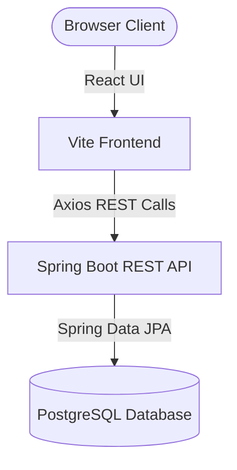

# SmartSlot: Integrated Timetable & Slot Management System

SmartSlot is a premium, real-time timetable management and room scheduling application designed for academic institutions. Built using a modern **React (Vite) + Spring Boot (Java) + PostgreSQL** stack, it provides an intuitive visual timetable grid, automated scheduling validation, HOD approval centers, and dynamic room/resource conflict prevention.

---

## 📋 Table of Contents
1. [Key Features](#-key-features)
2. [Technology Stack](#-technology-stack)
3. [Architecture Overview](#-architecture-overview)
4. [Academic & Scheduling Rules](#-academic--scheduling-rules)
5. [Database Configuration](#-database-configuration)
6. [Getting Started](#-getting-started)
   - [Prerequisites](#prerequisites)
   - [Backend Setup](#backend-setup)
   - [Frontend Setup](#frontend-setup)
7. [System Roles & Workflows](#-system-roles--workflows)
8. [API Endpoints Reference](#-api-endpoints-reference)

---

## ✨ Key Features
* **Interactive Weekly Grid**: Visual timetable displaying Monday to Saturday slots. Teachers can click empty slots (`+`) to instantly request or claim bookings.
* **Smart Section Grouping**: Supports joint/combined lectures where a teacher teaches multiple sections together in a large facility.
* **Automated Lab Blocks**: Schedules 2-hour continuous lab sessions automatically (slot $S$ and $S+1$) when a lab room is selected.
* **Real-time Status Banner**: Syncs and alerts teachers immediately in real-time when HOD approval center tickets are approved or rejected.
* **Conflict Prevention Engine**: Automatically validates room availability, teacher schedules, section calendars, and daily/weekly limits before creating bookings.
* **Advanced Capacity Checking**: Matches student strength dynamically against room capacity.
* **Role-Based Access Control**: Customized views and functionalities for `ADMIN`, `HOD`, and `TEACHER`.

---

## 💻 Technology Stack

### Frontend
* **Core**: React 18, Vite (Fast builds, Hot Module Replacement)
* **Routing**: React Router DOM (Declarative routing)
* **Styling**: Modern Vanilla CSS (Harmonious glassmorphic UI, responsive layouts)
* **API Client**: Axios with configured base URLs for seamless integration

### Backend
* **Core**: Spring Boot 3.x, Spring MVC, Spring Data JPA
* **Build System**: Maven (Wrapper included)
* **Lombok**: Boilerplate code reduction
* **DBMS**: PostgreSQL (Production-ready relational database)

---

## 🏗️ Architecture Overview



* **Frontend Structure**: Structured cleanly into `src/pages` (Login, Dashboard, Room, Section, Subject, Booking Management) and `src/components.jsx` (reusable grids, modals, forms).
* **Backend Structure**: Structured into clean layers: Controller -> Service -> Repository -> Model.

---

## ⚙️ Academic & Scheduling Rules
The backend contains a strict rule engine that validates every booking request:

| Rule Name | Description | Exemption / Override |
| :--- | :--- | :--- |
| **Teacher Break Rule** | A teacher cannot teach for more than 2 consecutive hours/slots. A 1-hour break is mandatory. | HOD Approved Ticket |
| **Room Capacity** | Combined section student count cannot exceed room capacity. | HOD Approved Ticket |
| **Daily Limit** | A section cannot have more than 1 class/lab of the same subject per day. | HOD Approved Ticket |
| **Weekly Limit** | Section subject lectures per week cannot exceed the subject's configuration. | HOD Approved Ticket |
| **Lab Constraints** | Lab periods must be 2 hours, starting on an odd slot (1, 3, 5, 7, 9). | HOD Approved Ticket |
| **Specialized Capacity** | Large rooms enforce section minimums (e.g. `NEW_AUDI` requires $\ge 4$ sections, `LT` requires $\ge 2$ sections). | HOD Approved Ticket |
| **Lunch Break** | Slot 4 is locked globally as a mandatory lunch break. | HOD Approved Ticket |

---

## 🗄️ Database Configuration
The application connects to a **PostgreSQL** database instance. The connection parameters are configured in `backend/src/main/resources/application.properties`:

```properties
spring.datasource.url=jdbc:postgresql://localhost:5432/timetable_db
spring.datasource.username=postgres
spring.datasource.password=YOUR_POSTGRES_PASSWORD

spring.jpa.hibernate.ddl-auto=update
spring.jpa.show-sql=true
spring.jpa.properties.hibernate.dialect=org.hibernate.dialect.PostgreSQLDialect
server.port=8082
```

---

## 🚀 Getting Started

### Prerequisites
* Java Development Kit (JDK) 17 or higher
* Node.js (v18 or higher) and npm
* PostgreSQL Server running locally on port 5432

### Backend Setup
1. Open a terminal in the `backend` directory.
2. Ensure you have created the database `timetable_db` in your PostgreSQL instance.
3. Run the Spring Boot application using Maven:
   ```bash
   # On Windows
   ./mvnw.cmd spring-boot:run
   
   # On Linux/macOS
   ./mvnw spring-boot:run
   ```
4. The server starts on port `8082`.

### Frontend Setup
1. Open a terminal in the `frontend` directory.
2. Install dependencies:
   ```bash
   npm install
   ```
3. Start the Vite development server:
   ```bash
   npm run dev
   ```
4. Open your browser and navigate to the displayed local URL (typically `http://localhost:5173`).

---

## 👥 System Roles & Workflows

### Admin Workflow
* Manage teachers, subjects, rooms, and sections.
* View the overall timetable booking status across the institution.
* Run full manual audit checks.

### Teacher Workflow
* View personal weekly timetable.
* Claim empty slots interactively directly from the grid.
* Book joint/combined classes or labs.
* View status of cancellation requests and tickets.
* Raise HOD tickets for exceptions when scheduling conflicts occur.

### HOD Workflow
* Access the **Approval Center** (under `/approvals`).
* Review override tickets raised by teachers.
* Approve or reject requests (instantly synced to teachers' dashboards).

---

## 🛰️ API Endpoints Reference

### Bookings API (`/api/bookings`)
* `POST /create` : Creates a new booking with full validation.
* `GET /all` : Retrieves all bookings.
* `GET /filter` : Gets filtered weekly bookings (params: `type`, `id`, `startDate`, `endDate`).
* `PUT /{id}` : Updates an existing booking.
* `DELETE /{id}` : Deletes/removes a booking.
* `POST /{id}/request-cancel` : Submits cancellation request.
* `POST /{id}/approve-cancel` : Approves cancellation request.
* `POST /{id}/reject-cancel` : Rejects cancellation request.

### Management APIs
* Teachers: `/api/teachers`
* Rooms: `/api/rooms`
* Sections: `/api/sections`
* Subjects: `/api/subjects`
* Overrides/Tickets: `/api/tickets`
