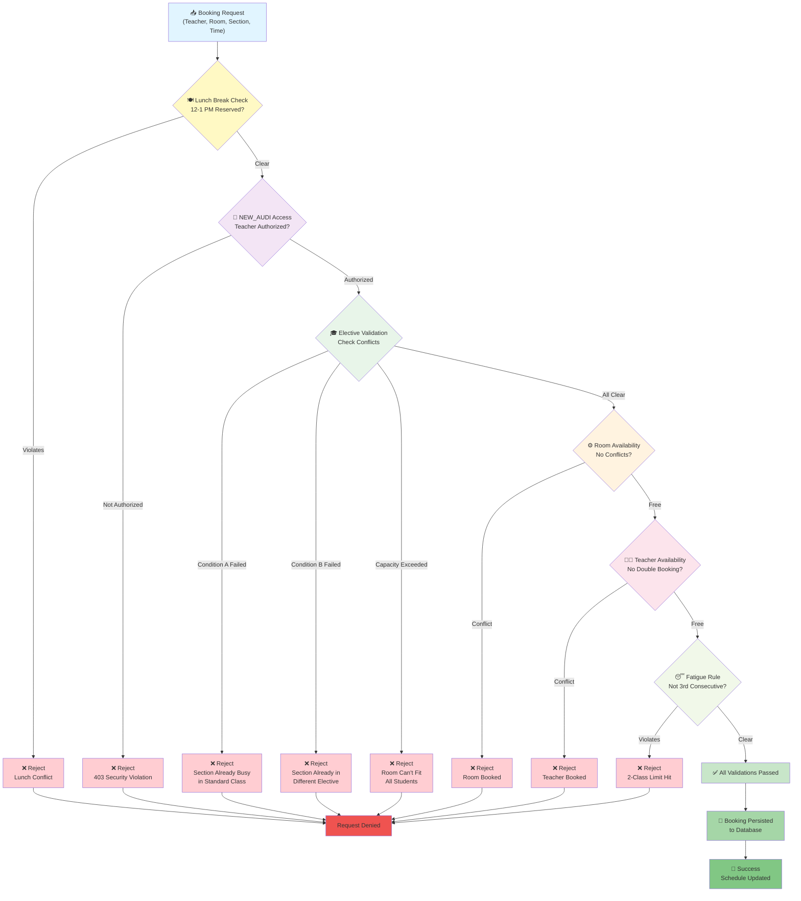
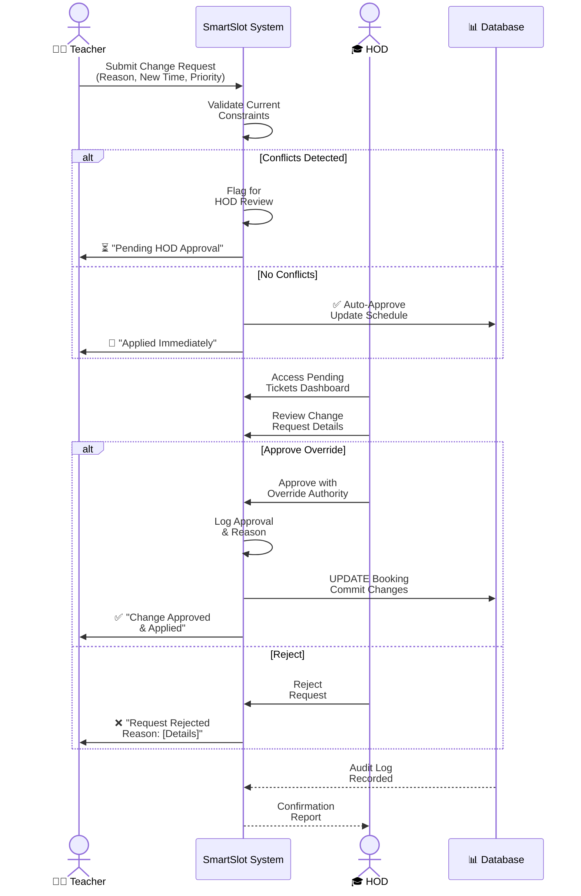

# 🎓 SmartSlot: Intelligent College Timetable Generation Engine

[](https://www.oracle.com/java/)
[](https://spring.io/projects/spring-boot)
[](https://www.postgresql.org/)
[](LICENSE)
[](https://github.com/YZO-BIT/SmartSlot)

---

## 🚀 The Problem We Solve

Every semester, college administrators face a **scheduling nightmare**: juggling hundreds of constraints simultaneously while avoiding the dreaded scenario where a teacher is booked in two classrooms at the same time, or a section is forced into conflicting classes. 

Traditional timetable generators treat constraints as afterthoughts. SmartSlot flips this paradigm—it's built from the ground up as a **conflict-aware, intelligent scheduling engine** that doesn't just avoid collisions; it intelligently orchestrates them away.

Think of it like **RedBus's dynamic seat allocation**—just for college timetables. We've engineered a sophisticated conflict resolution engine that validates bookings through multiple layers of rules before they ever hit the database.

---

## ✨ Why SmartSlot Matters

**The Statistics:**
- 🔴 **Manual scheduling**: 40+ hours of tedious work, countless errors
- 🟢 **SmartSlot**: Real-time validation, automated conflict detection, human-centric rules

**The Promise:**
> "A timetable that respects teacher well-being, enforces academic integrity, and handles complex grouping scenarios that would make spreadsheets cry."

---

## 🎯 Key Features

### 🛡️ **Human-Centric Rules**
We don't build schedules for robots—we build them for real people.

- **🍽️ Mandatory Lunch Break (12-1 PM)**
  - Every person in the institution gets a guaranteed break
  - No exceptions, no negotiations—teacher wellness first
  
- **😴 2-Class Fatigue Rule**
  - Teachers cannot teach more than 2 consecutive classes
  - Prevents burnout and improves teaching quality
  - SmartSlot automatically inserts breathing room

### 📚 **Academic Compliance Engine**
Ensures educational standards are met, not just schedules filled.

- **Lecture Frequency Enforcement**
  - Guarantees minimum weekly lectures per subject (`min_lectures_per_week`)
  - Validates that every subject gets its mandated classroom hours
  - Prevents "light weeks" that would jam subjects into crunch periods

- **Flexible Double-Period Handling**
  - Supports consecutive 2-hour slots when pedagogically needed
  - Respects the `is_split_allowed` flag for subjects that require continuous blocks
  - Intelligent packing to maximize room utilization

### 🔗 **Complex Elective Group Management**
The crown jewel—bi-directional conflict detection for sophisticated grouping scenarios.

- **Multi-Section Electives**
  - Combine students from multiple sections into specialized electives (AI, Cloud Computing, etc.)
  - Dynamically calculate total student count from all participating sections
  - Example: CSE-A (45) + CSE-B (48) + CSE-C (42) = Elective Group with 135 students

- **Bi-Directional Conflict Detection**
  - **Condition A**: Detects if any section in an elective group already has a standard class scheduled
  - **Condition B**: Prevents a section from joining an elective if it's already committed to another elective in that slot
  - **Capacity Validation**: Ensures the assigned room can fit all participating students

- **Real-World Example**
  ```
  Teacher tries to book "Cloud Computing" elective (CSE-A, CSE-B, CSE-C) at 2 PM
  ❌ BLOCKED: CSE-B already has "Database Management" at 2 PM
  SmartSlot prevents the booking instantly with a clear reason
  ```

### 🔐 **Role-Based Access Control**
Premium facilities demand premium permissions.

- **New Auditorium (NEW_AUDI) Security**
  - Only authorized faculty can access premium rooms
  - Teachers must possess `hasAudiAccess` clearance
  - Attempted bookings without clearance trigger 403 Security Violation errors
  - Prevents unauthorized usage of high-demand facilities

### 📋 **HOD Ticket & Approval Workflow**
Because sometimes rules need exceptions, but exceptions need oversight.

- **Teacher Ticket Submission**
  - Teachers can request timetable changes with justification
  - Tickets automatically routed to Head of Department

- **HOD Review & Decision**
  - HOD reviews conflict details and teacher justification
  - Can approve urgent rescheduling with override authority
  - All changes logged for audit compliance

---

## 🏗️ Architecture Overview

### The Booking Conflict Engine Flow

How SmartSlot validates a booking request through multiple validation layers before persisting to the database:



---

### The HOD Approval & Timetable Change Workflow

How exceptions are handled through structured approval processes:



---

## 🛠️ Technology Stack

| Component | Technology | Version | Purpose |
|-----------|-----------|---------|---------|
| **Framework** | Spring Boot | 4.0.3 | REST API & Core Application |
| **Language** | Java | 21+ | Type-safe, performant backend |
| **Database** | PostgreSQL | 15+ | Reliable RDBMS with ACID guarantees |
| **ORM** | Hibernate/JPA | Via Spring Data | Object-relational mapping |
| **Build Tool** | Maven | 3.9+ | Dependency management & compilation |
| **Boilerplate** | Lombok | Latest | Reduce getter/setter verbosity |

---

## 🚀 Getting Started

### Prerequisites

Ensure you have installed:
- **Java 21+** ([Download](https://www.oracle.com/java/technologies/downloads/))
- **PostgreSQL 15+** ([Download](https://www.postgresql.org/download/))
- **Maven 3.9+** ([Download](https://maven.apache.org/download.cgi))

### Step 1: Clone the Repository

```bash
git clone https://github.com/YZO-BIT/SmartSlot.git
cd SmartSlot/backend
```

### Step 2: Configure PostgreSQL Database

**Create a new database:**

```sql
CREATE DATABASE timetable_db;
```

**Update `application.properties`** in `src/main/resources/`:

```properties
# Database Configuration
spring.datasource.url=jdbc:postgresql://localhost:5432/timetable_db
spring.datasource.username=postgres
spring.datasource.password=your_postgres_password

# Hibernate Configuration
spring.jpa.hibernate.ddl-auto=update
spring.jpa.properties.hibernate.dialect=org.hibernate.dialect.PostgreSQLDialect
spring.jpa.show-sql=false

# Server Configuration
server.port=8081
```

⚠️ **Security Note**: Never commit `application-local.properties` or hardcoded credentials. Use environment variables in production:

```properties
spring.datasource.password=${DB_PASSWORD}
```

### Step 3: Build the Project

```bash
# Using Maven wrapper
./mvnw clean install

# Or if Maven is installed globally
mvn clean install
```

### Step 4: Run the Application

```bash
# Using Maven
./mvnw spring-boot:run

# Or run the compiled JAR
java -jar target/backend-0.0.1-SNAPSHOT.jar
```

**Output:**
```
Tomcat started on port(s): 8081 (http) with context path ''
Started BackendApplication in X.XXX seconds
DataInitializer: Loading sample data...
DataInitializer: 5 Rooms, 2 Teachers, 3 Sections, 6 Subjects initialized ✓
```

### Step 5: Verify Installation

**Check if the API is running:**

```bash
curl http://localhost:8081/api/validation/complete-validation
```

**Expected Response:**
```json
{
  "isFeasible": true,
  "errorMessages": []
}
```

---

## 📡 API Endpoints

### Validation Endpoints

| Method | Endpoint | Purpose |
|--------|----------|---------|
| `GET` | `/api/validation/complete-validation` | Full system pre-flight check |
| `GET` | `/api/validation/room-type/{type}` | Check room type availability |
| `GET` | `/api/validation/teacher-expertise` | Verify teacher qualifications |
| `GET` | `/api/validation/section-capacity` | Validate section slot overflow |

### Booking Management

| Method | Endpoint | Purpose |
|--------|----------|---------|
| `POST` | `/api/bookings` | Create new booking with full validation |
| `GET` | `/api/bookings` | List all bookings |

### Elective Group Management

| Method | Endpoint | Purpose |
|--------|----------|---------|
| `POST` | `/api/elective-groups` | Create new elective group |
| `GET` | `/api/elective-groups` | List all elective groups |
| `GET` | `/api/elective-groups/{id}` | Get group details |
| `PUT` | `/api/elective-groups/{id}` | Update group configuration |
| `DELETE` | `/api/elective-groups/{id}` | Remove group |

### Security & Testing

| Method | Endpoint | Purpose |
|--------|----------|---------|
| `POST` | `/api/security/test-audi-access` | Test NEW_AUDI facility access |

---

## 📊 Sample Data

On application startup, **DataInitializer** automatically populates the database with realistic test scenarios:

### 🏢 Rooms
- **CR-101** (Classroom): 70 seats
- **CR-102** (Classroom): 70 seats
- **LT-101** (Lecture Hall): 200 seats
- **LAB-01** (Laboratory): 50 seats
- **AUDI-01** (New Auditorium): 500 seats

### 👨‍🏫 Teachers
- **Dr. Sharma** (Computer Science)
  - NEW_AUDI Access: ✅ Authorized
  - Expertise: Databases, Algorithms, Cloud Computing
  
- **Prof. Verma** (Computer Science)
  - NEW_AUDI Access: ❌ Restricted
  - Expertise: Software Engineering, Design Patterns

### 🎓 Sections
- **CSE-A**: 45 students
- **CSE-B**: 48 students
- **CSE-C**: 42 students

### 📖 Subjects
**Core Subjects:**
- Data Structures (5 lectures/week, requires LAB)
- Algorithms (4 lectures/week, requires LT)
- Database Management (3 lectures/week, requires CR)
- Web Development (4 lectures/week, flexible)

**Elective Subjects:**
- AI & Machine Learning (3 lectures/week, requires LT)
- Cloud Computing (3 lectures/week, flexible)

### 🔗 Elective Groups
- **G1 - Premium Electives**: CSE-A + CSE-B + CSE-C = **135 students**
- **G2 - Advanced Track**: CSE-A + CSE-B = **93 students**

---

## 🧪 Testing

Run the test suite:

```bash
./mvnw test
```

**Test Coverage:**
- ✅ Spring context loads successfully
- ✅ Booking validation layers work in isolation
- ✅ Conflict detection catches real collisions
- ✅ Repository queries return expected results

---

## 📖 Documentation

Detailed documentation available in:
- **[Architecture Guide](./docs/ARCHITECTURE.md)** - System design deep dive
- **[API Reference](./docs/API.md)** - Complete endpoint specifications
- **[Constraint Definitions](./docs/CONSTRAINTS.md)** - Business rule explanations

---

## 🤝 Contributing

We believe in collaborative scheduling! 

1. **Fork** the repository
2. **Create** a feature branch (`git checkout -b feature/amazing-feature`)
3. **Commit** with clear messages (`git commit -m 'Add amazing timetable feature'`)
4. **Push** to your fork (`git push origin feature/amazing-feature`)
5. **Submit** a Pull Request

### Contribution Areas We Need Help With

- 🧬 Genetic Algorithm implementation for optimal schedule generation
- 🎨 Frontend dashboard (React/Vue)
- 📱 Mobile app for student schedule viewing
- 🌍 Multi-language support for international institutions
- 📈 Performance optimization for large-scale deployments

---

## 🐛 Known Issues & Roadmap

### Current Limitations
- Single institution support (multi-campus coming soon)
- Genetic algorithm not yet implemented (scheduled for v2.0)
- No frontend dashboard (WIP)

### Roadmap

| Phase | Features | Timeline |
|-------|----------|----------|
| **v1.0** | REST API + Core Validation | Q2 2026 |
| **v1.5** | HOD Approval Workflow | Q3 2026 |
| **v2.0** | Genetic Algorithm Integration | Q4 2026 |
| **v2.5** | React Frontend Dashboard | Q1 2027 |
| **v3.0** | Mobile App + Analytics | Q2 2027 |

---

## 📄 License

This project is licensed under the **MIT License** - see the [LICENSE](LICENSE) file for full details.

**TL;DR**: You can use, modify, and distribute SmartSlot freely, including in commercial projects.

---

## 💬 Get In Touch

- 📧 **Email**: [your-email@example.com]
- 🐦 **Twitter**: [@SmartSlotGen]
- 💼 **LinkedIn**: [Your LinkedIn Profile]
- 🐛 **Issues**: [Report bugs here](https://github.com/YZO-BIT/SmartSlot/issues)

---

## 🙏 Acknowledgments

- Built with ❤️ by developers who've suffered through manual timetabling
- Inspired by real scheduling challenges in educational institutions
- Thanks to the Spring Boot and PostgreSQL communities

---

<div align="center">

**Made with passion for educators and administrators.** ✨

⭐ If SmartSlot helped you, please star this repository! It means a lot.

</div>
